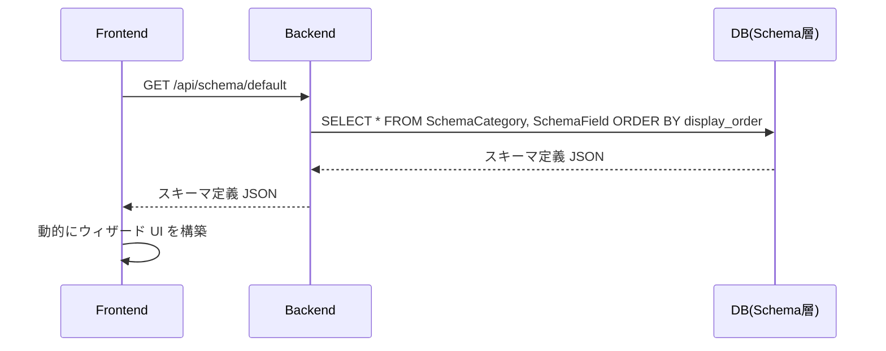
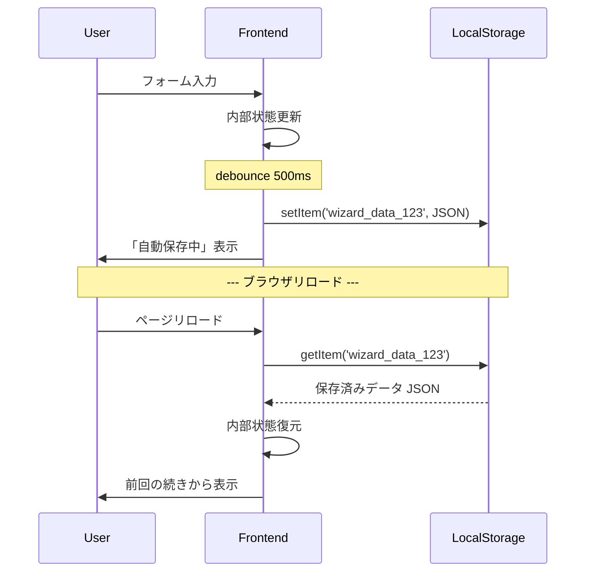
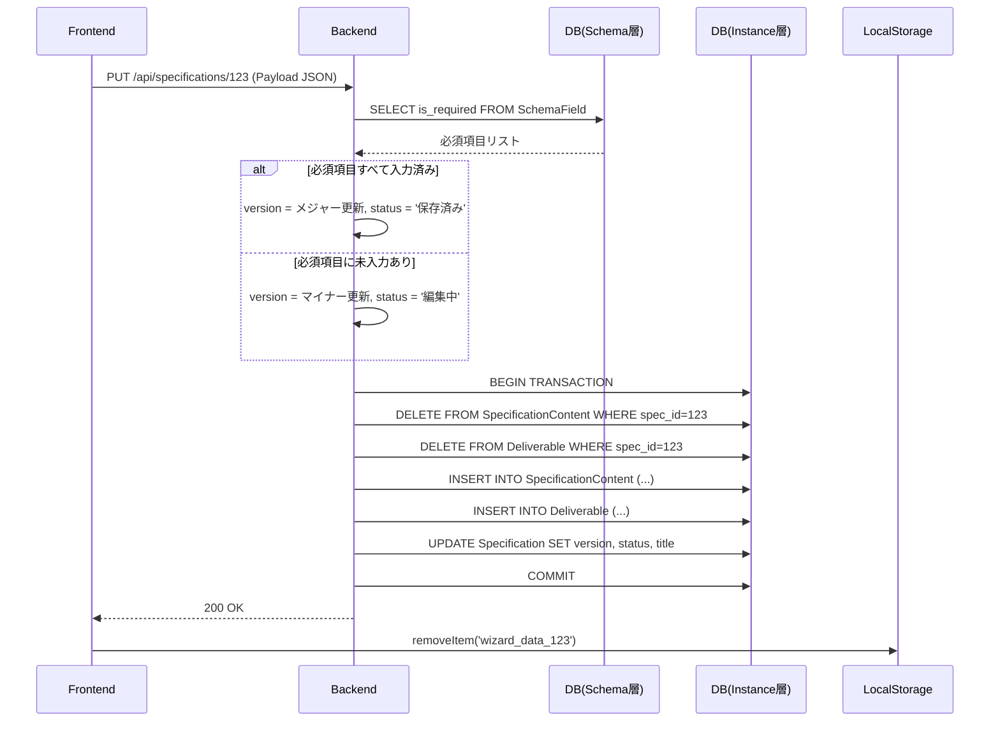

# 仕様書作成支援アプリ 実装戦略書

**文書バージョン**: 1.0
**作成日**: 2025-11-18
**対象**: 開発チーム全員
**参照仕様**: `docs/仕様書作成支援アプリ機能仕様書.md`

---

## 目次

1. [エグゼクティブサマリー](#1-エグゼクティブサマリー)
2. [プロジェクト概要と目的](#2-プロジェクト概要と目的)
3. [アーキテクチャ戦略](#3-アーキテクチャ戦略)
4. [実装フェーズ計画](#4-実装フェーズ計画)
5. [技術スタック詳細](#5-技術スタック詳細)
6. [セキュリティ戦略](#6-セキュリティ戦略)
7. [スケーラビリティ戦略](#7-スケーラビリティ戦略)
8. [開発ガイドライン](#8-開発ガイドライン)
9. [リスクとその対策](#9-リスクとその対策)
10. [今後のロードマップ](#10-今後のロードマップ)

---

## 1. エグゼクティブサマリー

### 1.1. プロジェクトの本質

本プロジェクトは、単なる「仕様書作成ツール」ではなく、**「仕様書作成ツールの定義ツール」**である。**メタモデル・アーキテクチャ**により、管理者がコード変更なしで仕様書のフォーマット自体を変更できる革新的なシステムを構築する。

### 1.2. 中核的な技術的決定事項

| 項目 | 決定事項 | 理由 |
|-----|---------|------|
| **アーキテクチャ** | メタモデル・アーキテクチャ（EAV + ハイブリッド） | 管理者が動的にウィザード構造を変更可能 |
| **データ保存** | ローカルストレージ自動保存 + サーバー永続化 | データ消失防止とシームレスな復元 |
| **バージョン管理** | 必須項目充足度によるメジャー/マイナー分岐 | 入力状態を明確に表現 |
| **Backend** | Node.js + TypeScript + Express + PostgreSQL | 型安全性、スケーラビリティ、監査可能性 |
| **Frontend** | React + TypeScript | 動的UI構築、型安全性 |
| **Cloud** | Google Cloud（他クラウド禁止） | プロジェクト要件 |

### 1.3. 実装状況サマリー

✅ **完了済み**:
- 型定義（エンティティインターフェース）の完全実装
- データモデル設計（12エンティティ）
- シーケンス図（全プロセスフロー）
- 開発ガイドライン（CLAUDE.md）

🚧 **次フェーズ**:
- データベーススキーマ実装
- バックエンドAPI実装
- フロントエンドUI実装

---

## 2. プロジェクト概要と目的

### 2.1. ビジネス課題

従来の仕様書作成プロセスにおける3つの主要課題:

1. **入力漏れの発生**: 複雑な項目の管理困難
2. **バージョン管理の煩雑さ**: 変更履歴の追跡が困難
3. **長時間作業によるデータ消失リスク**: ブラウザクラッシュ等

### 2.2. ソリューション

| 課題 | ソリューション | 技術的実現手段 |
|-----|-------------|------------|
| 入力漏れ | ウィザード形式 + 必須項目バリデーション | 動的フォーム生成、視覚的強調表示 |
| バージョン管理 | メジャー/マイナーバージョン自動管理 | バックエンドバリデーションロジック |
| データ消失 | ローカルストレージ自動保存 | LocalStorage API + 定期保存 |

### 2.3. ユーザーロール

#### 仕様書作成者 (Creator)
- **責務**: 仕様書データの入力
- **主要機能**: ダッシュボード、ウィザード、エクスポート
- **権限**: 自身の仕様書のみ CRUD 可能

#### 仕様書管理者 (Admin)
- **責務**: スキーマ（テンプレート）の管理
- **主要機能**: スキーマ設定画面
- **権限**: スキーマ層の完全な CRUD 権限

---

## 3. アーキテクチャ戦略

### 3.1. メタモデル・アーキテクチャ

本システムの最大の特徴であり、技術的競争力の源泉。

```
┌─────────────────────────────────────────┐
│     スキーマ層（定義）                    │
│  Schema → SchemaCategory → SchemaField  │
│         管理者が編集する「型」            │
└─────────────┬───────────────────────────┘
              │ 定義
              ▼
┌─────────────────────────────────────────┐
│   インスタンス層（データ）                │
│  Specification → SpecificationContent   │
│       作成者が入力する「値」              │
└─────────────────────────────────────────┘
```

#### 3.1.1. スキーマ層（定義）

**目的**: ウィザードの構造を動的に定義

| エンティティ | 役割 |
|------------|------|
| `Schema` | テンプレート全体（例：「デフォルトスキーマ」） |
| `SchemaCategory` | ウィザードの各ステップ（例：「1. 基本情報」） |
| `SchemaField` | 各ステップ内の入力項目（例：「件名」、データ型、必須フラグ） |

**重要**: 管理者が `SchemaField` を追加・削除してもアプリケーションの再デプロイは不要。

#### 3.1.2. インスタンス層（データ）

**目的**: 実際の仕様書データを格納

**ハイブリッド型データ格納戦略**:
- **EAV パターン**: 単純なフィールド（件名、目的等）は `SpecificationContent` に格納
- **独立テーブル**: 構造化された 1:N リスト（納品物、業務タスク等）は専用テーブルに格納

**ハイブリッド型を採用する理由**:
```sql
-- ❌ 純粋 EAV の場合（集計が困難）
SELECT COUNT(*) FROM SpecificationContent
WHERE field_id = 'business_tasks'
  AND JSON_ARRAY_LENGTH(value) > 0;  -- 低速

-- ✅ ハイブリッド型（高速集計）
SELECT COUNT(*) FROM BusinessTask
WHERE specification_id = ?;  -- 高速
```

### 3.2. システム構成図

```
┌──────────────────────────────────────────────────────────┐
│                  ユーザー層                                │
│         仕様書作成者 (Creator)  │  仕様書管理者 (Admin)    │
└───────────────────┬──────────────────────────────────────┘
                    │ HTTPS
┌───────────────────▼──────────────────────────────────────┐
│              クライアントサイド (Browser)                   │
│  ┌──────────────┐        ┌────────────────────┐          │
│  │ Frontend SPA │◄──────►│ LocalStorage       │          │
│  │ (React + TS) │        │ (自動保存/復元)      │          │
│  └──────┬───────┘        └────────────────────┘          │
└─────────┼──────────────────────────────────────────────┘
          │ REST API (JSON)
┌─────────▼──────────────────────────────────────────────┐
│              サーバーサイド                               │
│  ┌────────────────────────────────────────┐             │
│  │  Backend API (Express + TypeScript)    │             │
│  │  - ビジネスロジック                     │             │
│  │  - バリデーション                       │             │
│  │  - ファイル生成 (PDF/Word/MD)          │             │
│  └──────┬─────────────────────────────────┘             │
│         │                                                │
│  ┌──────▼───────────────────────┐                       │
│  │   PostgreSQL Database        │                       │
│  │  ┌──────────────────────┐    │                       │
│  │  │ スキーマ層（定義）     │    │                       │
│  │  │ Schema, Category,    │    │                       │
│  │  │ Field                │    │                       │
│  │  └──────────────────────┘    │                       │
│  │  ┌──────────────────────┐    │                       │
│  │  │ インスタンス層（データ）│    │                       │
│  │  │ Specification,       │    │                       │
│  │  │ Content, Deliverable │    │                       │
│  │  └──────────────────────┘    │                       │
│  └──────────────────────────────┘                       │
└─────────────────────────────────────────────────────────┘
```

### 3.3. データフロー戦略

#### 3.3.1. 動的フォーム生成フロー



**重要ポイント**: UI はハードコードされていない。スキーマ定義を読み込んで動的に構築。

#### 3.3.2. 自動保存・復元フロー



**設計思想**: サーバーに一切負荷をかけずにデータ消失を防止。

#### 3.3.3. 最終保存トランザクションフロー



**重要**: `DELETE & INSERT` パターンのため、トランザクションの堅牢性が絶対不可欠。

---

## 4. 実装フェーズ計画

### Phase 0: 基盤整備（完了）✅

- [x] プロジェクト初期化
- [x] 型定義実装（12エンティティ）
- [x] 開発ガイドライン策定
- [x] データモデル設計
- [x] シーケンス図作成

### Phase 1: データベース層（2-3週間）

#### 1.1. PostgreSQL スキーマ実装

**優先度**: 🔴 最優先

**タスク**:
- [ ] マイグレーションツール選定（Prisma / Knex / TypeORM）
- [ ] 12エンティティのテーブル定義
- [ ] インデックス戦略実装
- [ ] 外部キー制約設定
- [ ] デフォルトスキーマのシードデータ作成

**成果物**:
- `migrations/` ディレクトリ配下のマイグレーションファイル
- `seeds/` ディレクトリ配下のシードデータ

**セキュリティチェック**:
- [ ] SQLインジェクション対策（パラメータ化クエリ）
- [ ] RBAC 制約の実装
- [ ] 監査ログテーブル設計

#### 1.2. ORM 統合

**推奨**: Prisma（型安全性、マイグレーション機能、PostgreSQL親和性）

```typescript
// prisma/schema.prisma (例)
model User {
  user_id       String   @id @default(uuid()) @db.Uuid
  email         String   @unique
  password_hash String
  full_name     String
  created_at    DateTime @default(now())

  specifications Specification[]
  user_roles     UserRole[]

  @@map("users")
}
```

### Phase 2: バックエンド API（4-5週間）

#### 2.1. API 設計

**RESTful エンドポイント**:

| エンドポイント | メソッド | 説明 | 認証 |
|-------------|---------|------|------|
| `/api/auth/login` | POST | ユーザーログイン | - |
| `/api/auth/logout` | POST | ログアウト | ✓ |
| `/api/users/me` | GET | 現在のユーザー情報 | ✓ |
| `/api/specifications` | GET | 仕様書一覧取得 | ✓ |
| `/api/specifications` | POST | 新規仕様書作成 | ✓ |
| `/api/specifications/:id` | GET | 仕様書詳細取得 | ✓ |
| `/api/specifications/:id` | PUT | 仕様書保存 | ✓ |
| `/api/specifications/:id/export` | GET | エクスポート（PDF/Word/MD） | ✓ |
| `/api/schema` | GET | スキーマ定義取得 | ✓ |
| `/api/schema` | PUT | スキーマ更新 | ✓ (Admin) |
| `/api/schema/reset` | POST | デフォルト復元 | ✓ (Admin) |

#### 2.2. 認証・認可実装

**推奨技術**:
- **JWT (JSON Web Token)**: ステートレス認証
- **bcrypt**: パスワードハッシュ化
- **Passport.js**: 認証ミドルウェア

**RBAC 実装例**:
```typescript
// middleware/auth.ts
export const requireRole = (roleName: RoleName) => {
  return async (req: Request, res: Response, next: NextFunction) => {
    const user = req.user as UserWithRoles;
    if (!hasRole(user, roleName)) {
      return res.status(403).json({ error: 'Forbidden' });
    }
    next();
  };
};

// routes/schema.ts
router.put('/api/schema',
  authenticate,
  requireRole(RoleName.ADMINISTRATOR),  // 管理者のみ
  updateSchema
);
```

#### 2.3. コアビジネスロジック実装

**重要モジュール**:

1. **バリデーションエンジン**
   - 必須項目チェック
   - データ型検証
   - カスタムバリデーションルール

2. **バージョン管理エンジン**
   - メジャー/マイナーバージョン判定
   - バージョン番号の自動インクリメント

3. **ファイル生成エンジン**
   - PDF生成（推奨: Puppeteer / PDFKit）
   - Word生成（推奨: docx ライブラリ）
   - Markdown生成（テンプレートエンジン）

#### 2.4. エラーハンドリング戦略

```typescript
// errors/AppError.ts
export class AppError extends Error {
  constructor(
    public statusCode: number,
    public message: string,
    public isOperational: boolean = true
  ) {
    super(message);
  }
}

// middleware/errorHandler.ts
export const errorHandler = (
  err: Error,
  req: Request,
  res: Response,
  next: NextFunction
) => {
  if (err instanceof AppError) {
    return res.status(err.statusCode).json({
      status: 'error',
      message: err.message
    });
  }

  // 本番環境ではスタックトレースを隠蔽
  logger.error(err);
  return res.status(500).json({
    status: 'error',
    message: 'Internal server error'
  });
};
```

### Phase 3: フロントエンド実装（5-6週間）

#### 3.1. プロジェクト構造

```
src/frontend/
├── components/
│   ├── common/              # 共通コンポーネント
│   │   ├── Button.tsx
│   │   ├── Input.tsx
│   │   └── Modal.tsx
│   ├── layout/              # レイアウト
│   │   ├── Header.tsx
│   │   ├── Sidebar.tsx
│   │   └── Layout.tsx
│   ├── dashboard/           # ダッシュボード
│   │   ├── SpecificationList.tsx
│   │   └── StatusBadge.tsx
│   ├── wizard/              # ウィザード
│   │   ├── WizardContainer.tsx
│   │   ├── StepProgress.tsx
│   │   ├── DynamicField.tsx
│   │   └── ReviewSummary.tsx
│   └── admin/               # 管理画面
│       └── SchemaEditor.tsx
├── hooks/
│   ├── useAuth.ts
│   ├── useLocalStorage.ts
│   ├── useAutoSave.ts
│   └── useSpecification.ts
├── services/
│   ├── api.ts               # API クライアント
│   ├── auth.service.ts
│   ├── specification.service.ts
│   └── schema.service.ts
├── store/                   # 状態管理
│   ├── authSlice.ts
│   ├── wizardSlice.ts
│   └── store.ts
├── utils/
│   ├── validation.ts
│   └── formatting.ts
└── types/                   # フロントエンド固有の型
    └── dto.ts
```

#### 3.2. 状態管理戦略

**推奨**: Redux Toolkit（複雑な状態管理に適合）

```typescript
// store/wizardSlice.ts
interface WizardState {
  specificationId: string | null;
  schema: SchemaWithStructure | null;
  data: Record<string, FieldValue>;
  currentStep: number;
  validationErrors: Record<string, string>;
  isSaving: boolean;
}

const wizardSlice = createSlice({
  name: 'wizard',
  initialState,
  reducers: {
    updateField: (state, action: PayloadAction<{ fieldId: string; value: FieldValue }>) => {
      state.data[action.payload.fieldId] = action.payload.value;
    },
    loadFromLocalStorage: (state, action: PayloadAction<WizardState>) => {
      return action.payload;
    },
    // ...
  }
});
```

#### 3.3. 動的フォーム生成

**最重要コンポーネント**: `DynamicField.tsx`

```typescript
interface DynamicFieldProps {
  field: SchemaField;
  value: FieldValue;
  onChange: (value: FieldValue) => void;
  error?: string;
}

export const DynamicField: React.FC<DynamicFieldProps> = ({
  field,
  value,
  onChange,
  error
}) => {
  switch (field.data_type) {
    case FieldDataType.TEXT:
      return <Input value={value as string} onChange={onChange} />;

    case FieldDataType.TEXTAREA:
      return <Textarea value={value as string} onChange={onChange} />;

    case FieldDataType.CHECKBOX:
      const choices = getFieldChoices(field);
      return <CheckboxGroup choices={choices} value={value as string[]} onChange={onChange} />;

    case FieldDataType.LIST:
      // 動的リスト（納品物、業務タスク等）
      return <DynamicList entityType={field.list_target_entity} value={value} onChange={onChange} />;

    // ...
  }
};
```

#### 3.4. 自動保存フック

```typescript
// hooks/useAutoSave.ts
export const useAutoSave = (
  specificationId: string,
  data: Record<string, FieldValue>,
  delay: number = 500
) => {
  const [isSaving, setIsSaving] = useState(false);

  const debouncedSave = useMemo(
    () =>
      debounce(() => {
        setIsSaving(true);
        localStorage.setItem(
          `wizard_data_${specificationId}`,
          JSON.stringify(data)
        );
        setIsSaving(false);
      }, delay),
    [specificationId, data, delay]
  );

  useEffect(() => {
    debouncedSave();
    return () => debouncedSave.cancel();
  }, [data, debouncedSave]);

  return { isSaving };
};
```

### Phase 4: 統合・テスト（2-3週間）

#### 4.1. テスト戦略

| テスト種類 | カバレッジ目標 | ツール |
|-----------|--------------|--------|
| ユニットテスト | 80%以上 | Jest |
| 統合テスト | 主要エンドポイント100% | Supertest |
| E2Eテスト | クリティカルパス100% | Playwright / Cypress |
| セキュリティテスト | OWASP Top 10 | OWASP ZAP |

#### 4.2. パフォーマンステスト

**目標**:
- 1万ユーザー同時接続対応
- API レスポンスタイム < 200ms (95パーセンタイル)
- データベースクエリ < 50ms

**ツール**: Apache JMeter / k6

### Phase 5: デプロイメント（1週間）

#### 5.1. Google Cloud アーキテクチャ

```
┌────────────────────────────────────────────────────┐
│               Google Cloud Platform                │
│                                                    │
│  ┌──────────────┐      ┌────────────────────┐    │
│  │ Cloud Load   │─────►│ Cloud Run          │    │
│  │ Balancing    │      │ (Frontend + Backend)│    │
│  └──────────────┘      └──────┬─────────────┘    │
│                                │                    │
│                        ┌───────▼──────────┐        │
│                        │ Cloud SQL        │        │
│                        │ (PostgreSQL)     │        │
│                        └──────────────────┘        │
│                                                    │
│  ┌──────────────────────────────────────────┐    │
│  │ Cloud Secret Manager                     │    │
│  │ (環境変数、APIキー管理)                   │    │
│  └──────────────────────────────────────────┘    │
└────────────────────────────────────────────────────┘
```

#### 5.2. CI/CD パイプライン

**推奨**: GitHub Actions + Cloud Build

```yaml
# .github/workflows/deploy.yml
name: Deploy to Cloud Run

on:
  push:
    branches: [main]

jobs:
  test:
    runs-on: ubuntu-latest
    steps:
      - uses: actions/checkout@v3
      - name: Run tests
        run: npm test
      - name: Security scan
        run: npm audit

  deploy:
    needs: test
    runs-on: ubuntu-latest
    steps:
      - name: Deploy to Cloud Run
        uses: google-github-actions/deploy-cloudrun@v1
        with:
          service: spec-manager
          region: asia-northeast1
```

---

## 5. 技術スタック詳細

### 5.1. Backend

| カテゴリ | 技術 | 選定理由 |
|---------|------|---------|
| ランタイム | Node.js 20 LTS | 最新LTS、パフォーマンス向上 |
| 言語 | TypeScript 5.x | 型安全性、開発効率 |
| フレームワーク | Express.js | シンプル、拡張性高い |
| ORM | Prisma | 型安全、マイグレーション、PostgreSQL親和性 |
| 認証 | Passport.js + JWT | 標準的、拡張可能 |
| バリデーション | Zod | TypeScript統合、ランタイム検証 |
| ログ | Winston | 構造化ログ、監査対応 |
| PDF生成 | Puppeteer | ヘッドレスChrome、高品質 |
| Word生成 | docx | .docx生成、TypeScript対応 |

### 5.2. Frontend

| カテゴリ | 技術 | 選定理由 |
|---------|------|---------|
| フレームワーク | React 18 | 動的UI構築、豊富なエコシステム |
| 言語 | TypeScript 5.x | 型安全性 |
| 状態管理 | Redux Toolkit | 複雑な状態管理、DevTools |
| ルーティング | React Router 6 | 標準的、TypeScript対応 |
| UIライブラリ | Material-UI (MUI) | 高品質コンポーネント、カスタマイズ可能 |
| フォーム | React Hook Form | パフォーマンス、バリデーション統合 |
| HTTP | Axios | インターセプター、型安全 |
| ビルド | Vite | 高速、HMR |

### 5.3. Database

| 項目 | 設定値 | 理由 |
|-----|--------|------|
| RDBMS | PostgreSQL 15 | JSONB、UUID、高度なインデックス |
| 接続プーリング | PgBouncer | コネクション効率化 |
| バックアップ | 自動日次 | データ保護 |
| レプリケーション | リードレプリカ | 読み取り負荷分散 |

### 5.4. Infrastructure

| コンポーネント | Google Cloud サービス |
|--------------|---------------------|
| コンテナ実行 | Cloud Run |
| データベース | Cloud SQL (PostgreSQL) |
| シークレット管理 | Cloud Secret Manager |
| ロードバランシング | Cloud Load Balancing |
| CDN | Cloud CDN |
| 監視・ログ | Cloud Logging / Cloud Monitoring |
| CI/CD | Cloud Build |

---

## 6. セキュリティ戦略

### 6.1. OWASP Top 10 対策

| 脆弱性 | 対策 | 実装箇所 |
|-------|------|---------|
| **A01: Broken Access Control** | RBAC実装、リソース所有権チェック | Backend Middleware |
| **A02: Cryptographic Failures** | bcrypt (password)、HTTPS強制 | Auth Service、Nginx |
| **A03: Injection** | パラメータ化クエリ（Prisma ORM） | Database層 |
| **A04: Insecure Design** | セキュアな設計レビュー | 全体設計 |
| **A05: Security Misconfiguration** | 環境変数、Secret Manager使用 | Infrastructure |
| **A06: Vulnerable Components** | `npm audit`、定期更新 | CI/CD |
| **A07: Authentication Failures** | JWT、レート制限、強力なパスワード | Auth Service |
| **A08: Data Integrity Failures** | 署名付きトークン、CSRF対策 | Backend |
| **A09: Logging Failures** | 構造化ログ、監査ログ | Winston |
| **A10: SSRF** | URL検証、ホワイトリスト | 該当機能なし |

### 6.2. 認証・認可フロー

```
1. ログイン
   User --[email, password]--> Backend
   Backend --[bcrypt.compare]--> DB
   Backend --[JWT sign]--> User (httpOnly cookie)

2. API リクエスト
   User --[JWT in cookie]--> Backend
   Backend --[verify JWT]--> Middleware
   Middleware --[check role]--> Route Handler

3. リソースアクセス
   Route Handler --[check ownership]--> DB
   IF (user.id == resource.author_id OR user.role == Admin)
     -> Allow
   ELSE
     -> 403 Forbidden
```

### 6.3. データ暗号化

| データ種別 | 暗号化方式 | 場所 |
|-----------|-----------|------|
| パスワード | bcrypt (コスト12) | DB |
| JWT トークン | HS256 署名 | Cookie (httpOnly, secure) |
| 通信 | TLS 1.3 | HTTPS |
| 機密環境変数 | Google Secret Manager | Infrastructure |

### 6.4. レート制限

```typescript
// middleware/rateLimiter.ts
import rateLimit from 'express-rate-limit';

export const apiLimiter = rateLimit({
  windowMs: 15 * 60 * 1000, // 15分
  max: 100, // 最大100リクエスト
  message: 'Too many requests from this IP'
});

export const authLimiter = rateLimit({
  windowMs: 15 * 60 * 1000,
  max: 5, // ログイン試行は5回まで
  message: 'Too many login attempts'
});

// app.ts
app.use('/api/', apiLimiter);
app.use('/api/auth/login', authLimiter);
```

---

## 7. スケーラビリティ戦略

### 7.1. 目標スペック

- **同時接続ユーザー**: 10,000人
- **仕様書総数**: 100,000件
- **API レスポンスタイム**: < 200ms (p95)
- **データベースクエリ**: < 50ms
- **可用性**: 99.9% (年間ダウンタイム < 8.76時間)

### 7.2. データベース最適化

#### インデックス戦略

```sql
-- 仕様書一覧表示の高速化
CREATE INDEX idx_specifications_author_updated
ON specifications(author_user_id, updated_at DESC);

-- EAV クエリの高速化
CREATE INDEX idx_specification_content_spec_field
ON specification_content(specification_id, field_id);

-- JSONB 検索の高速化（将来的）
CREATE INDEX idx_specification_content_value_gin
ON specification_content USING GIN (value);

-- スキーマ定義取得の高速化
CREATE INDEX idx_schema_fields_category_order
ON schema_fields(category_id, display_order);
```

#### クエリ最適化例

```typescript
// ❌ N+1問題
const specs = await prisma.specification.findMany();
for (const spec of specs) {
  spec.author = await prisma.user.findUnique({ where: { user_id: spec.author_user_id } });
}

// ✅ JOIN による一括取得
const specs = await prisma.specification.findMany({
  include: {
    author: {
      select: { user_id: true, full_name: true, email: true }
    }
  }
});
```

### 7.3. キャッシュ戦略

| データ | キャッシュ層 | TTL | 無効化トリガー |
|-------|------------|-----|-------------|
| スキーマ定義 | Redis | 1時間 | 管理者がスキーマ更新時 |
| ユーザー情報 | メモリ | 15分 | ユーザー情報更新時 |
| 仕様書一覧 | なし | - | リアルタイム性重視 |

```typescript
// services/cache.service.ts
import Redis from 'ioredis';

const redis = new Redis(process.env.REDIS_URL);

export async function getOrSetCache<T>(
  key: string,
  fetcher: () => Promise<T>,
  ttl: number = 3600
): Promise<T> {
  const cached = await redis.get(key);
  if (cached) {
    return JSON.parse(cached);
  }

  const data = await fetcher();
  await redis.setex(key, ttl, JSON.stringify(data));
  return data;
}

// 使用例
const schema = await getOrSetCache(
  'schema:default',
  () => prisma.schema.findFirst({ where: { is_default: true }, include: { ... } }),
  3600
);
```

### 7.4. 非同期処理

**重い処理はバックグラウンドジョブとして実行**:

| 処理 | 実装方式 | ツール |
|-----|---------|--------|
| PDF生成 | ジョブキュー | Bull (Redis) |
| メール送信 | ジョブキュー | Bull |
| 大量データエクスポート | ストリーミング | Node.js Streams |

```typescript
// jobs/exportPdf.job.ts
import Queue from 'bull';

const pdfQueue = new Queue('pdf-export', process.env.REDIS_URL);

pdfQueue.process(async (job) => {
  const { specificationId } = job.data;
  const pdf = await generatePDF(specificationId);
  return { url: pdf.url };
});

// API エンドポイント
app.get('/api/specifications/:id/export/pdf', async (req, res) => {
  const job = await pdfQueue.add({ specificationId: req.params.id });
  res.json({ jobId: job.id });
});
```

---

## 8. 開発ガイドライン

### 8.1. コーディング規約

#### TypeScript

```typescript
// ✅ Good: 厳格な型定義
interface User {
  user_id: UUID;
  email: Email;
  full_name: string;
}

// ❌ Bad: any型の使用
const user: any = getUserData();

// ✅ Good: Enum使用
enum FieldDataType {
  TEXT = 'text',
  TEXTAREA = 'textarea'
}

// ❌ Bad: マジックストリング
if (field.type === 'text') { ... }
```

#### エラーハンドリング

```typescript
// ✅ Good: カスタムエラークラス
class NotFoundError extends AppError {
  constructor(resource: string) {
    super(404, `${resource} not found`, true);
  }
}

// ✅ Good: 非同期エラーハンドリング
try {
  const spec = await specificationService.findById(id);
} catch (error) {
  if (error instanceof NotFoundError) {
    return res.status(404).json({ error: error.message });
  }
  throw error; // 予期しないエラーは上位に伝播
}

// ❌ Bad: エラーの無視
const spec = await specificationService.findById(id).catch(() => null);
```

### 8.2. Git ワークフロー

```
main (本番)
  ├── develop (開発統合ブランチ)
  │     ├── feature/wizard-ui
  │     ├── feature/schema-api
  │     └── feature/pdf-export
  └── hotfix/critical-bug-fix (緊急修正)
```

**コミットメッセージ規約**:
```
<type>(<scope>): <subject>

<body>

<footer>
```

例:
```
feat(wizard): ウィザードの動的フォーム生成を実装

- SchemaField に基づいてフォームを動的生成
- DynamicField コンポーネントの実装
- バリデーションロジックの統合

Closes #123
```

### 8.3. コードレビュー基準

**必須チェック項目**:
- [ ] TypeScript の型エラーなし (`tsc --noEmit`)
- [ ] Linter エラーなし (`npm run lint`)
- [ ] テストが通る (`npm test`)
- [ ] セキュリティチェック (`npm audit`)
- [ ] コードカバレッジ > 80%
- [ ] パフォーマンス考慮（N+1問題など）
- [ ] ログ記録の適切性
- [ ] エラーハンドリングの完全性

---

## 9. リスクとその対策

### 9.1. 技術リスク

| リスク | 影響度 | 確率 | 対策 |
|-------|-------|------|------|
| **EAVパターンのパフォーマンス低下** | 🔴 高 | 🟡 中 | インデックス戦略、ハイブリッド設計、キャッシュ |
| **ローカルストレージの容量制限** | 🟡 中 | 🟢 低 | 5MB制限、超過時は古いデータを削除 |
| **大量データのエクスポート遅延** | 🟡 中 | 🟡 中 | バックグラウンドジョブ、ストリーミング |
| **スキーマ変更によるデータ不整合** | 🔴 高 | 🟡 中 | マイグレーションスクリプト、バージョン管理 |

### 9.2. セキュリティリスク

| リスク | 影響度 | 対策 |
|-------|-------|------|
| **認可バイパス** | 🔴 高 | RBAC徹底、リソース所有権チェック |
| **SQLインジェクション** | 🔴 高 | Prisma ORM、パラメータ化クエリ |
| **XSS攻撃** | 🔴 高 | React自動エスケープ、DOMPurify |
| **CSRF攻撃** | 🟡 中 | SameSite Cookie、CSRFトークン |

### 9.3. 運用リスク

| リスク | 対策 |
|-------|------|
| **データベース障害** | 自動バックアップ、リードレプリカ |
| **アプリケーション障害** | ヘルスチェック、自動再起動、ロールバック |
| **負荷急増** | 水平スケーリング（Cloud Run自動スケール） |

---

## 10. 今後のロードマップ

### MVP (Minimum Viable Product)

**リリース目標**: 3ヶ月後

**含まれる機能**:
- ✅ ユーザー認証・RBAC
- ✅ 仕様書作成（ウィザード）
- ✅ 自動保存・復元
- ✅ 基本的なエクスポート（PDF）
- ✅ スキーマ設定（基本機能）

### Phase 2 機能拡張（MVP + 3-6ヶ月）

- [ ] リアルタイムコラボレーション（WebSocket）
- [ ] 高度な承認ワークフロー
- [ ] Word/Markdown エクスポート
- [ ] 全文検索機能（Elasticsearch）
- [ ] 監査ログ閲覧UI

### Phase 3 エンタープライズ機能（MVP + 6-12ヶ月）

- [ ] SAML/SSO統合
- [ ] API公開（外部連携）
- [ ] 高度な分析ダッシュボード
- [ ] AIによる仕様書レビュー提案
- [ ] マルチテナント対応

---

## まとめ

本実装戦略書は、**メタモデル・アーキテクチャ**という革新的な設計思想を中核に据え、セキュリティ、スケーラビリティ、監査可能性を実現するための包括的な技術戦略を提示した。

### 成功の鍵

1. **動的スキーマの完全実現**: 管理者がコード変更なしでUIを変更できる柔軟性
2. **堅牢なトランザクション**: DELETE & INSERT パターンにおけるデータ整合性
3. **シームレスなUX**: ローカルストレージによるデータ消失防止
4. **型安全性の徹底**: TypeScript strict モードによるバグ削減
5. **段階的な実装**: MVP から段階的に機能拡張

開発チームは、本戦略書を指針として、高品質で保守性の高いシステムを構築する。

---

**承認**:
- [ ] プロジェクトマネージャー
- [ ] テックリード
- [ ] セキュリティ担当
- [ ] インフラ担当

**文書管理**:
- 次回レビュー日: 2025-12-18
- 改訂履歴: [別紙参照]
